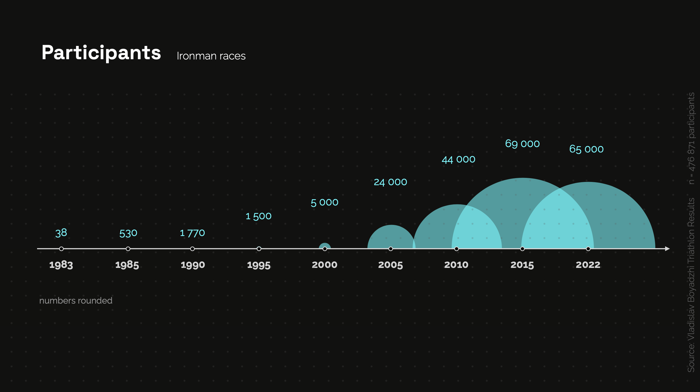
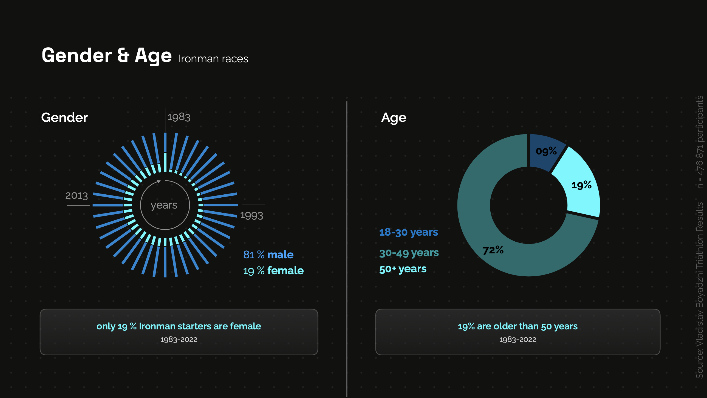

## What is Triathlon? 

Business Understanding: Giving context to our project (coding by Katharina Kreß)

In this part we wanted to give some insights about Triathlon itself.  
Our Datasets include information about events and athletes from 1983-2022.  
We wanted datadriven insights like growth of events & athletes, gender- and age-distribution over the time.

In this Folder are two Notebooks:

-  **01_clean_Triathlon_dataset** - checking NaN, duplicates, change datatypes, droping columns, first visualisation with geopandas
  
- **02_prep_Traithlon_dataset** - preparing for a tableau dashboard by adding new columns designed to become parameter
    - special_category like Pro & Para Athletes
    - distance like sprint or olympic
    - new age-classes

---------------------
examples of visualisations:

