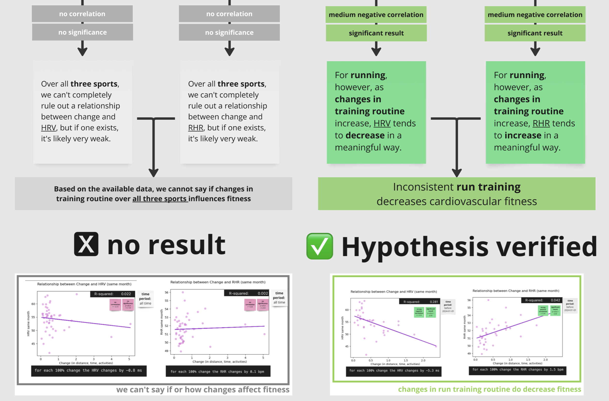

## Does consistent training improve fitness? 
(coding by Nono Weinzierl)

In this part of our project we analysed 4+ years worth of training & physical data by Nono, who is an amateur triathlete. 

### structure
In this folder you'll find 8 notebooks
  - 01 Cleaning Training Data: Cleaning the training data downloaded from the training platform Strava
        - 01a Fit to CSV conversion: Converting individual activity files from .fit to .csv
        - 01b HR Zones Runs:  Labelling each run as high or low intensity
  - 02 Cleaning Physical Data: Cleaning the physical and sleep data downloaded from the the platform Whoop
  - 03 Join Activs & Phys: Joining activity data and physical data into one large dataframe
  - 04 Loading: Loading the created .csv files to the database
  - 05 Fitness Factors Analysis: Analysing which factors influence general HRV/RHR fitness
  - 06 Change Consistency Analysis: Analysing which how change influences HRV & RHR development

### results
Hypothesis 2: We believe that consistent training improves cardiovascular fitness in endurance sports

Key Oberservation 1: 

--> Over all three sports, we can't completely rule out a relationship between change and HRV, but if one exists, it's likely very weak. (no correlation & no significance) 

Key Oberservations 2: 

--> For running, as changes in training routine increase, HRV tends to decrease in a meaningful way. (medium negative correlation (significant)) 

Learnings: 

Inconsistent run training decreases cardiovascular fitness. (Hypothesis verified)

 

