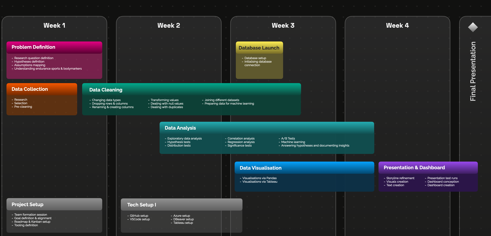
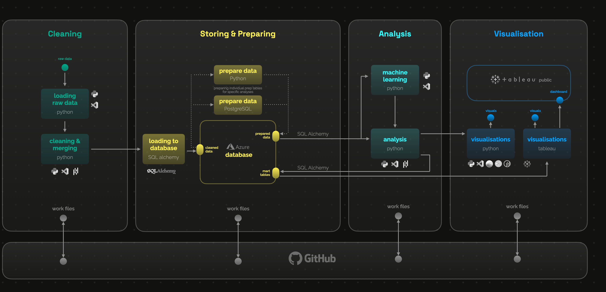
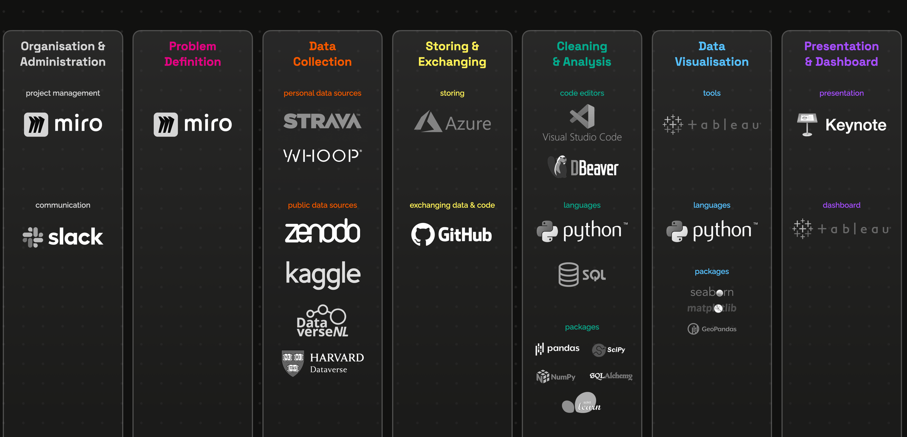
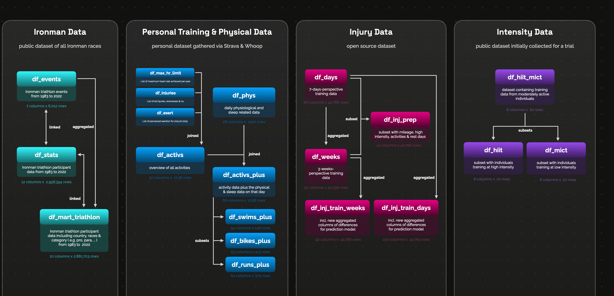

# Endurance Sports Data Project - March 2025 🏅 

Welcome to the **Endurance Sports Data Project** documentation!  

This project was developed by **Aisling Hooran, Katharina Kreß & Nono Weinzierl** as part of the **Advanced Data Analytics Bootcamp** by neuefische Coding School in March 2025. The goal of this project is to leverage data analysis techniques to gain insights into endurance sports, with a primary focus on Triathlon.  

Team on LinkedIn:  
🟣 [Aisling Hooran](https://www.linkedin.com/in/aisling-h)    
🔴 [Katharina Kreß](https://www.linkedin.com/in/kathkre)  🟢   
🔵 [Nono Weinzierl](https://www.linkedin.com/in/nonow)    

Presentation:  
[Video](https://www.youtube.com/watch?v=QgPFDA-3sPc)  
[Readme](https://github.com/katharina-data/Endurance-Sport-Performance_Capstone-Project_2025/edit/main/README.md#:~:text=injury_matrix.png-,readme_presentation,-.pdf)

Dashboard:  
[tableau](https://public.tableau.com/app/profile/nono.weinzierl/viz/TriathlonTrainingTracking/TriathlonTrainingDashboard)

More about the Data Analytics Bootcamp:  
[neuefische](https://www.neuefische.de/en/bootcamp/data-analytics)

## 🗺️ **Roadmap**

---
## 🏁 **Project Goals**  

Our analysis took place in four areas:  
  🟢 Triathlon  
  🟣 Intensity  
  🔵 Consistency  
  🔴 Injury Prevention 

By analysing these key factors, we aim to improve  training strategies, performance tracking and injury prevention for athletes.

Throughout this documentation, we’ll explore various aspects of the project, from data collection and analysis to actionable insights that can help athletes optimize their training and performance.  

Whether you're an athlete, coach, or data enthusiast, this project offers valuable insights into how data analytics can drive improvements in endurance sports.  

---
## 🗂️ **Repo Organisation**  

The repository is structured into different folders, each focusing on a key aspect of endurance sports analysis. The coding for each section was contributed by:  

- `triathlon/` - Coded by *Katharina Kreß*  
- `intensity/` - Coded by *Aisling Horan*  
- `consistency/` - Coded by *Nono Weinzierl*  
- `injury/` - Coded by *Katharina Kreß*

---
## 📊 **Analysis & Results**
---

### 🟢 **Triathlon Data Analysis**  
Triathlon, a sport combining swimming, cycling, and running, has grown significantly over the past 30 years. This project analyses global triathlon events (1983-2022) and athlete results to visualize participation trends.  

#### 🟢 **Key Findings**  
- Triathlon has expanded worldwide, with strong participation from Europe, North America, and Oceania.  
- Data standardization was needed for consistent country codes.  
- Further analysis could explore gender distribution and regional trends.  

#### 🟢 **Conclusion**  
This project highlights the global reach of triathlon through data visualization. Future work can delve into demographic trends and participation patterns for deeper insights.  

---
### 🟣 **Intensity Analysis**  
This project examined how training intensity impacts cardiovascular fitness, using resting heart rate (RHR) as a key measure.  

#### 🟣 **Key Findings**  
- **HIIT:** Reduced RHR by **9.1%**, with greater benefits for less fit individuals.  
- **MICT:** Reduced RHR by **4.6%**, with no clear correlation to pre-training RHR.  
- **Personal Data:** Confirmed HIIT’s superior impact on RHR reduction.  

#### 🟣 **Conclusion**  
HIIT is the most effective for cardiovascular gains. Future studies should explore long-term effects and individual differences.  

---
### 🔵 **Consistency Analysis**  
This analysis examined how training consistency affects cardiovascular fitness, focusing Heart Rate Variability (HRV).  

#### 🔵 **Key Findings**  
- **All Sports Combined:** No significant correlation between consistency and fitness improvements.  
- **Running Only:** Inconsistent training led to **higher RHR and lower HRV**, indicating reduced cardiovascular fitness.  

#### 🔵 **Conclusion**  
While consistency had no clear impact across all sports, maintaining a steady **running routine** is crucial for cardiovascular health.  

---
### 🔴 **Injury Analysis**  
This dataset accompanies a study on injury prediction in competitive runners using machine learning. The analysis focuses on objective training metrics rather than self-reported data. Two key hypotheses were tested: (1) whether training changes significantly before an injury and (2) whether inconsistent training increases injury risk.  

#### 🔴 **Key Findings**  
- **Training patterns change before an injury** – Significant differences were observed in mileage, high-intensity training, sessions, and rest days before an injury.  
- **Training inconsistency does not predict injury risk** – No correlation was found between inconsistent training and injury occurrence.  
- **Individual athlete data analysis supports the first hypothesis** – A triathlete's personal dataset showed similar trends in pre-injury training patterns.  

#### 🔴 **Conclusion**  
This analysis confirms that training volume and intensity shift before an injury but rejects inconsistency as a predictor. Future research could further refine machine learning models to enhance injury prediction and prevention strategies.  

---
---
## 🚀 **Tech Stack Overview**

This tech stack outlines the various tools and technologies used across different stages of the data pipeline, from problem definition to presentation.  

---
## 🛠️ **Data Architecture**  

This data architecture outlines the entire workflow, from raw data processing to visualization, ensuring a structured and efficient data pipeline. The process is divided into four main stages: Cleaning, Storing & Preparing, Analysis, and Visualization.  

---
## 📗 **Conclusion** 

This project provides valuable insights into the relationship between training intensity, consistency, and injury patterns in endurance sports. By leveraging statistical analysis and data visualization, we have identified key trends that can help athletes optimize their training while minimizing injury risks.  

Our findings highlight the importance of structured training programs, gradual workload progression, and the role of recovery in athletic performance. While this analysis presents meaningful conclusions, future work can expand on these insights by incorporating machine learning models and larger datasets to refine predictions and personalize training recommendations.  

By continuing to explore endurance sports data, we aim to contribute to the ongoing efforts in sports science, helping athletes and coaches make data-driven decisions for enhanced performance and injury prevention.  

